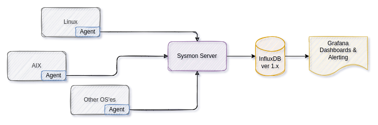

# System Monitor

Open source system monitoring solution with support for plugins and scripts.

This software is free to use and is licensed under the [Apache 2.0 License](LICENSE).

- Example dashboards are provided in the [doc/dashboards/](doc/dashboards/) folder, which can be imported into your Grafana installation.
- Screenshots of some of the default dashboards are available in [doc/screenshots](doc/screenshots/) section.



Some of my other related projects are:

- [hmci](https://github.com/mnellemann/hmci) for agent-less monitoring of IBM Power servers
- [svci](https://github.com/mnellemann/svci) for monitoring IBM Spectrum Virtualize (Flashsystems / Storwize / SVC)
- [syslogd](https://github.com/mnellemann/syslogd) for redirecting syslog and GELF to other logging destinations

## Screenshots


Screenshots of other dashboards are available in the [doc/screenshots](doc/screenshots/) folder.

## Components

### Server

The server component receives aggregated metrics from *clients* and saves these into InfluxDB.

- Downloaded server package from [releases](/mnellemann/sysmon/releases).
- More information and documentation on the [sysmon-server](server/README.md).

### Client & Plugins

The client runs on all or some of your hosts and collects metrics, which are then sent to the central sysmon-server component. Plugins are loaded by the client at startup and should also be installed.

- Downloaded client & plugin packages from [releases](/mnellemann/sysmon/releases).
- More information and documentation on the [sysmon-client](client/README.md).
. More information and documentation on the [sysmon-plugins](plugins/README.md).


## Known problems

### Correct timezone and clock

- Ensure you have **correct timezone and date/time** and NTPd (or similar) running to keep it accurate!

### Naming collision

You can't have hosts with the same name, as these cannot be distinguished when metrics are
written to InfluxDB (which uses the hostname as key).

### Renaming hosts

If you rename a host, the metrics in InfluxDB will still be available by the old hostname, and new metrics will be written with the new hostname. There is no easy way to migrate the old data, but you can delete it easily:

```text
USE sysmon;
DELETE WHERE hostname = 'unknown';
```
